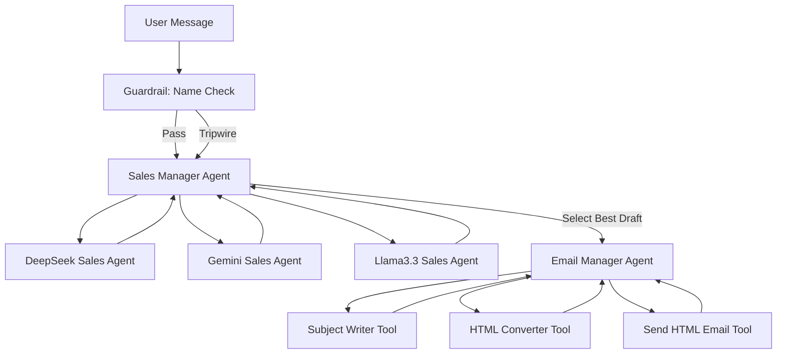

# Agent Flow in 3_lab3.ipynb

Below is a Mermaid diagram explaining the agent orchestration and flow in the notebook:

---

---

**Flow Explanation:**

1. **User** sends a message (e.g., request to send a cold sales email).
2. **Guardrail** checks for personal names in the input (input guardrail).
3. If passed, the **Sales Manager Agent** orchestrates:
    - Uses three **Sales Agent tools** (DeepSeek, Gemini, Llama3.3) to generate drafts.
    - Evaluates drafts and selects the best one.
4. The winning draft is handed off to the **Email Manager Agent**.
    - Uses **Subject Writer** to generate a subject.
    - Uses **HTML Converter** to format the body.
    - Uses **Send HTML Email Tool** to send the email.

This flow ensures structured outputs, model diversity, and input guardrails for safe and effective email generation.
